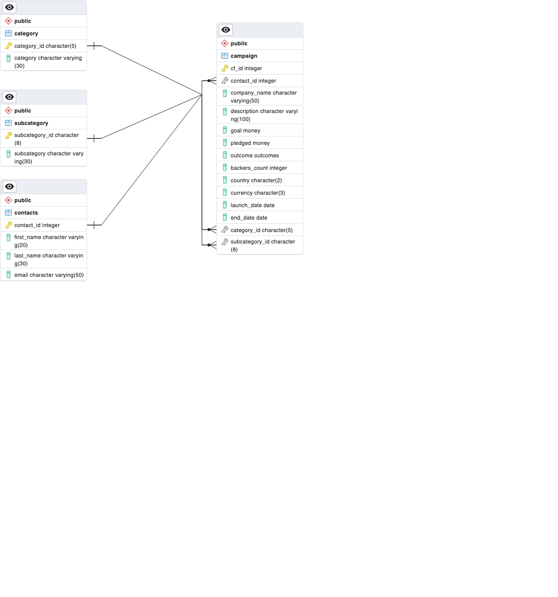

# Project 2, DU Data Analysis
Group Project, Team Members are:
* Anisa Braun
* Tony Coast
* Nels Jacobson
* Amy Paschal

## Part 1: Python Pandas
The python code creates the following, using the data in **crowdfunding.xlsx** and **contacts.xlsx** :
* a Category dataframe with columns category_id and category. Category_id is of the form catX, where X is a sequential integer.
* a Subcategory dataframe with columns subcategory_id and subcategory. Category_id is of the form subcatXX, where XX is a sequential integer.
* a Campaign dataframe will the following columns:
  1.   cf_id                    1000 non-null   int64
  2.   contact_id               1000 non-null   int64
  3.   company_name             1000 non-null   object
    4.   description              1000 non-null   object
  5.   goal                     1000 non-null   float64
  6.   pledged                  1000 non-null   float64
  7.   outcome                  1000 non-null   object
  8.   backers_count            1000 non-null   int64
  9.   country                  1000 non-null   object
  10.   currency                 1000 non-null   object
  11.  launch_date              1000 non-null   datetime64[ns]
  12.  end_date                 1000 non-null   datetime64[ns]
  13.  staff_pick               1000 non-null   bool
  14.  spotlight                1000 non-null   bool
  15.  category & sub-category  1000 non-null   object
  16.  category                 1000 non-null   object
  17.  subcategory              1000 non-null   object
  18.  category_id              1000 non-null   object
  19.  subcategory_id           1000 non-null   object
* Each dataframe is saved to a csv file.

## Part 2: SQL DB
A Postgres database was created with the following schema:

Tables were loaded from the CSV files created in part 1.

